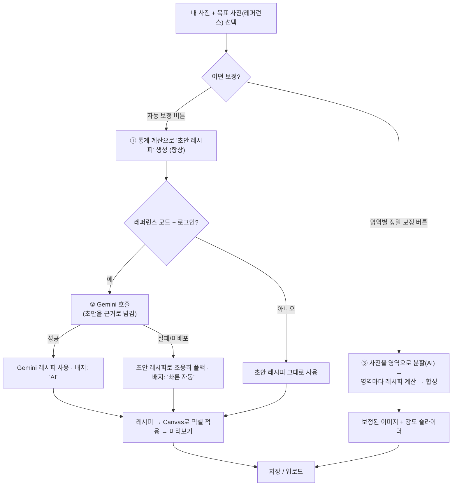

# AI 색감 보정, 어떻게 작동하나

> RE:FRAME의 "AI 색감 보정"이 **무엇을 입력받아 → 어떻게 계산해서 → 어떤 값을 만들고 → 이미지에 어떻게 적용**하는지 정리한 문서입니다. 코드를 처음 보는 사람도 흐름을 이해할 수 있도록 썼어요.

---

## 0. 한 줄 요약

> **목표 사진(레퍼런스)의 색감을 분석해, 내 사진을 그 색감에 가깝게 만드는 "보정값"을 계산하고, 브라우저에서 픽셀에 직접 적용합니다.**

- 계산 방법은 상황에 따라 **3가지 엔진** 중 하나가 쓰입니다.
- AI가 하는 일은 **"얼마나 보정할지 숫자를 정하는 것"** 이고, **실제 픽셀을 바꾸는 것은 코드(Canvas)** 입니다.

---

## 1. 핵심 개념 — "보정 레시피(6개 값)"

모든 보정의 결과물은 결국 아래 **6개 숫자**입니다. 이걸 이 문서에서는 **레시피(recipe)** 라고 부릅니다.

| 값 | 뜻 | 범위 |
|---|---|---|
| `exposure` | 밝기(노출) | -2 ~ 2 |
| `contrast` | 대비 | -50 ~ 50 |
| `highlights` | 밝은 영역 | -100 ~ 100 |
| `shadows` | 어두운 영역 | -100 ~ 100 |
| `saturation` | 채도 | -50 ~ 50 |
| `temperature` | 색온도(+따뜻/−차가움) | -1000 ~ 1000 |

> 정의 위치: [`src/types/adjustment.ts`](../src/types/adjustment.ts)

즉 "AI 색감 보정"이란 결국 **이 6개 숫자를 잘 정하는 문제**입니다. (영역별 보정만 예외 — 아래 3-C 참고)

---

## 2. 3가지 엔진 한눈에 보기

| 엔진 | 무엇을 하나 | 언제 쓰나 | 특징 |
|---|---|---|---|
| **A. 통계 계산** (로컬) | 두 사진의 픽셀 평균·편차를 재서 수학으로 레시피를 역산 | 항상 (기본·폴백) | 빠름·무료·오프라인·항상 같은 결과 |
| **B. Gemini AI** (하이브리드) | 두 사진을 실제로 "보고" 레시피를 판단 (통계 초안을 근거로) | 레퍼런스 모드 + 로그인 + 함수 배포됨 | 맥락 이해, 대신 네트워크·비용·실패 가능 |
| **C. 영역별 정밀 보정** | 하늘·건물·나무·인물 등으로 **나눠서** 영역마다 따로 보정 | 사용자가 "영역별 정밀 보정" 버튼을 누를 때 | 가장 정교, 대신 무거움(AI 모델 로드) |

---

## 3. 전체 흐름



> 진입점: [`src/pages/AiAdjustPage.tsx`](../src/pages/AiAdjustPage.tsx)

---

## 3-A. 엔진 A — 통계 계산 (로컬, 항상 동작)

가장 기본이 되는 엔진입니다. **AI 없이, 브라우저에서 수학만으로** 레시피를 만듭니다.

**작동 순서**
1. 두 사진을 작게 줄여서 픽셀을 훑습니다.
2. 각 사진의 **통계**를 측정합니다:
   - 평균 밝기, 밝기 표준편차(=대비 지표), 빨강/파랑 평균(=색온도 지표), 평균 채도, **밝은 영역/어두운 영역 각각의 평균 밝기**
3. "내 사진 통계 → 레퍼런스 통계"가 되게 하는 6개 값을 **역산**합니다.
   - 예) 노출 = `log2(레퍼런스 밝기 / 내 밝기)`
   - 하이라이트/섀도우는 밝은/어두운 영역의 밝기 차이를 맞추도록 역산

> 코드: [`src/utils/colorMatch.ts`](../src/utils/colorMatch.ts) — `analyzeStats()`(측정), `computeMatchRecipe()`(역산)

**장점** 빠르고, 실패가 거의 없고, **같은 입력이면 항상 같은 결과**(결정론적).
**한계** 사진 **전체 평균**만 보기 때문에, 구도가 많이 다른 두 사진(예: 하늘 위주 vs 인물 클로즈업)은 어긋날 수 있습니다.

---

## 3-B. 엔진 B — Gemini AI (하이브리드)

"레퍼런스 모드"(피드에서 어떤 사진의 색감을 고른 경우) + 로그인 상태일 때, 통계 계산에 더해 **Gemini가 두 사진을 실제로 보고 판단**합니다.

**작동 순서**
1. 내 사진을 Storage에 업로드해 URL을 얻습니다.
2. `analyze-photo` **Edge Function**을 호출합니다.
   - 함수는 두 이미지를 base64로 Gemini에 첨부하고,
   - **엔진 A가 만든 통계 초안(baseline)을 "근거"로 함께 전달**합니다 → 모델이 맨땅에서 추측하지 않고 초안 위에서 다듬습니다. (**하이브리드**)
3. Gemini는 **구조화된 JSON(responseSchema)** 으로 6개 값을 반환합니다. (형식 오류·이상값 차단)
4. 범위를 벗어난 값은 코드가 clamp 합니다.

> 코드: [`supabase/functions/analyze-photo/index.ts`](../supabase/functions/analyze-photo/index.ts)
> 모델·키(`GEMINI_API_KEY`)는 **서버 시크릿**이라 브라우저에 노출되지 않습니다. `temperature: 0`으로 같은 입력엔 최대한 같은 결과가 나오게 합니다.

**중요 — 조용한 폴백**: 함수가 아직 배포 안 됐거나 네트워크/인증 등으로 실패하면, **에러를 내지 않고 조용히 엔진 A(통계 초안)로 대체**합니다. 그래서 화면에 **어떤 엔진이 적용됐는지 배지**를 보여줍니다:
- 🟢 "AI가 두 사진을 분석해 맞춘 색감이에요" (엔진 B 성공)
- ⚪ "기기에서 빠르게 계산한 자동 보정이에요" (엔진 A)

---

## 3-C. 엔진 C — 영역별 정밀 보정 (의미 분할)

가장 정교한 방식. **사진을 의미 있는 영역(하늘·건물·나무·인물·물 등)으로 나눠, 영역마다 따로 색을 맞춥니다.** Lightroom·Evoto 같은 프로 툴의 "부분 보정" 아이디어를 가볍게 구현한 것입니다.

**작동 순서**
1. **의미 분할(Semantic Segmentation)**: 브라우저에서 **SegFormer** 모델(ADE20K, 150개 클래스)을 실행해 내 사진과 레퍼런스를 픽셀 단위로 "이건 하늘, 이건 물, 이건 건물…"로 나눕니다.
   - 라이브러리: `@huggingface/transformers` (Transformers.js) — 서버 없이 **브라우저에서** 추론
   - 무거워서(모델 수십 MB) **버튼을 누를 때만 다운로드/로드**됩니다.
2. **영역별 매칭**: 같은 종류의 영역끼리 통계를 비교해 레시피를 만듭니다.
   - 하늘 ↔ 하늘, 물 ↔ 물 …
   - 레퍼런스에 **짝이 없는 영역**(예: 하늘 레퍼런스에 맞추는 내 바다)은 **레퍼런스 전체 톤**을 기준으로 맞추되, 색이 과하게 튀지 않게 **채도·색온도에 상한**을 둡니다.
   - 두 사진의 장면이 **너무 다르면**(겹치는 영역 < 15%) 영역별을 끄고 **전체 톤 이식**으로 자동 전환합니다.
3. **경계 페더링**: 영역 경계가 딱딱하게 끊기지 않도록, 영역별 레시피를 **블러로 부드럽게 섞습니다**.
4. **화질 유지**: 분할은 작게(빠르게) 하고, 완성된 레시피를 **원본급 해상도에 업샘플해서 적용** → 저해상도로 보정해 생기던 화질 저하가 없습니다.
5. **보정 강도 슬라이더(0~100%)**: 원본 ↔ 보정본을 실시간으로 섞어 사용자가 세기를 직접 맞춥니다. (재분할 없이 즉시 반영)

> 코드: [`src/features/segment/segmentImage.ts`](../src/features/segment/segmentImage.ts)(분할),
> [`src/features/segment/regionalMatch.ts`](../src/features/segment/regionalMatch.ts)(영역별 계산·페더링),
> [`src/features/segment/regionalAdjust.ts`](../src/features/segment/regionalAdjust.ts)(전체 오케스트레이션)

> 결과가 **이미지 자체**로 나오므로(엔진 A·B처럼 6개 숫자가 아님), 저장·업로드는 이 이미지를 그대로 사용합니다.

---

## 4. 레시피 → 실제 픽셀 적용 (엔진 A·B 공통)

레시피 6개 값이 정해지면, 브라우저 Canvas에서 **모든 픽셀에 아래 순서대로** 연산을 적용합니다.

```
1) 노출    각 채널 × 2^exposure
2) 색온도  R += warmShift,  B -= warmShift   (warmShift = temperature/1000 × 40)
3) 대비    (값 - 128) × (1 + contrast/100) + 128
4) 하이라이트/섀도우
          밝은 픽셀(밝기>128)  → 하이라이트만큼 가감
          어두운 픽셀(밝기≤128) → 섀도우만큼 가감
5) 채도    밝기를 기준으로 색을 (1 + saturation/100)배 확장/축소
```

> 코드: [`src/utils/imageAdjustment.ts`](../src/utils/imageAdjustment.ts) — `applyAdjustment()`
> 미리보기: `AdjustmentPreview` 컴포넌트, 저장용 렌더: `colorMatch.ts`의 `renderAdjustedBlob()`

이 순서는 **통계 계산이 값을 역산할 때 가정한 순서와 동일**합니다. 그래서 "계산 → 적용"이 서로 어긋나지 않습니다.

---

## 5. 결과 반환 → 화면 → 저장/업로드

1. **미리보기**: 엔진 A·B는 레시피를 실시간 적용해 보여주고, 사용자는 **항목별 슬라이더로 미세조정**할 수 있습니다. 엔진 C는 보정된 이미지 + **강도 슬라이더**를 보여줍니다.
2. **저장**: 현재 결과를 JPEG로 만들어 다운로드.
3. **업로드로 사용**: 보정 결과를 실제 파일로 만들어 업로드 마법사로 넘깁니다. **원본은 그대로 두어** EXIF/GPS 분석은 항상 원본 기준으로 동작합니다. (영역별 결과는 이미 픽셀에 반영돼 있어 "추가 보정 없음"으로 전달)

---

## 6. 관련 파일 지도

| 역할 | 파일 |
|---|---|
| 화면·전체 흐름 | [`src/pages/AiAdjustPage.tsx`](../src/pages/AiAdjustPage.tsx) |
| 레시피 타입·범위 | [`src/types/adjustment.ts`](../src/types/adjustment.ts) |
| 통계 계산(엔진 A) | [`src/utils/colorMatch.ts`](../src/utils/colorMatch.ts) |
| 픽셀 적용 | [`src/utils/imageAdjustment.ts`](../src/utils/imageAdjustment.ts) |
| Gemini(엔진 B) | [`supabase/functions/analyze-photo/index.ts`](../supabase/functions/analyze-photo/index.ts) |
| 분할(엔진 C) | [`src/features/segment/segmentImage.ts`](../src/features/segment/segmentImage.ts) |
| 영역별 계산·페더링 | [`src/features/segment/regionalMatch.ts`](../src/features/segment/regionalMatch.ts) |
| 영역별 오케스트레이션 | [`src/features/segment/regionalAdjust.ts`](../src/features/segment/regionalAdjust.ts) |
| 개발용 비교 페이지 | `/dev/segment` ([`src/pages/dev/SegmentPocPage.tsx`](../src/pages/dev/SegmentPocPage.tsx)) |

---

## 7. 자주 나오는 궁금증

- **AI가 이미지를 직접 그리나요?** 아니요. AI(Gemini)는 **6개 숫자를 판단**할 뿐이고, 실제 픽셀 변경은 **코드가** 합니다. 엔진 C의 AI(SegFormer)도 "영역 나누기"만 하고, 색 계산·적용은 코드가 합니다.
- **왜 결과가 때때로 달라 보이나요?** 엔진 A(통계)는 항상 같은 결과지만, 엔진 B(Gemini)는 생성형이라 미세하게 다를 수 있고, 실패 시 조용히 A로 바뀌기 때문입니다. → 그래서 **어떤 엔진인지 배지로 표시**합니다.
- **Gemini 키가 유출되지 않나요?** 키는 서버(Edge Function) 시크릿이라 브라우저로 나가지 않습니다.
- **인터넷이 없어도 되나요?** 엔진 A는 오프라인 가능. 엔진 B는 서버·Gemini 필요, 엔진 C는 최초 1회 모델 다운로드가 필요합니다.

---

## 8. 한계 & 앞으로

- 엔진 A/B는 **전역 6개 값**이라 부분 보정이 안 됩니다 → 엔진 C가 이를 보완.
- 엔진 C는 **모델 로드가 무겁고**(모바일에서 느릴 수 있음), 분할 정확도는 모델 크기(b0<b2<b5)에 비례합니다.
- Gemini 하이브리드 개선을 실제로 쓰려면 `analyze-photo` **함수 재배포**가 필요합니다(미배포 시 자동으로 통계 폴백).
